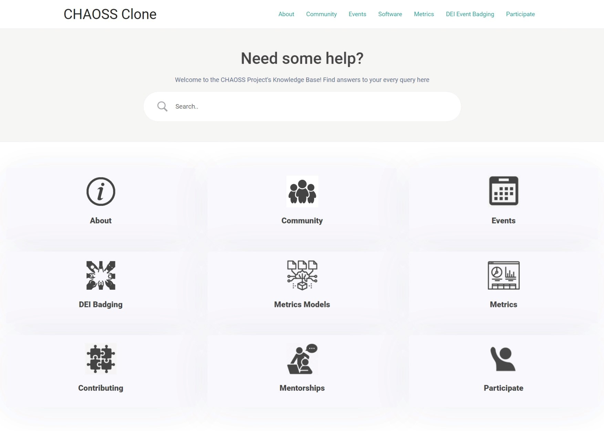
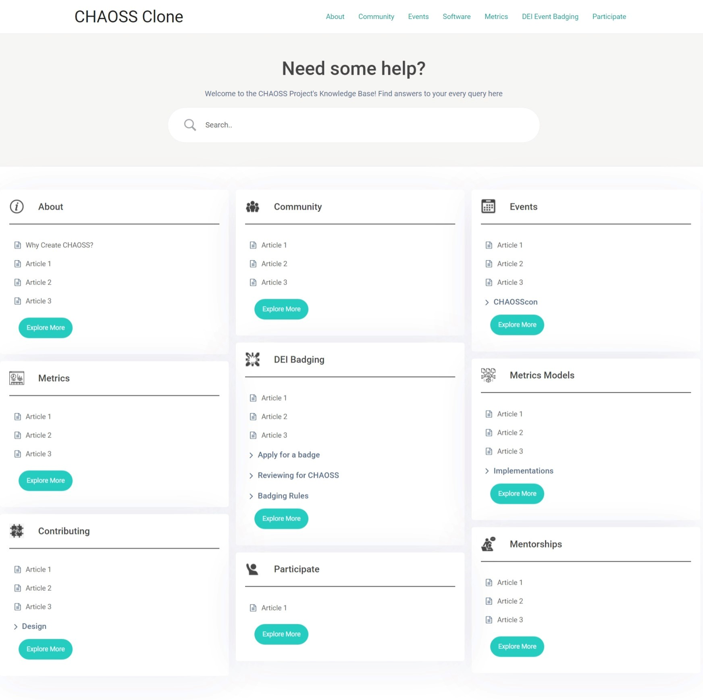
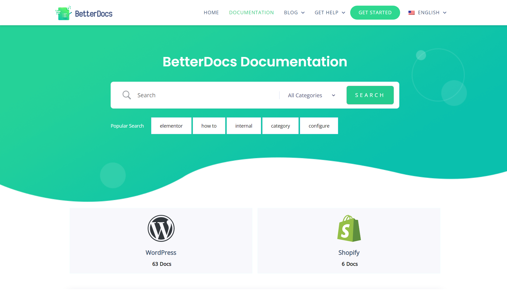
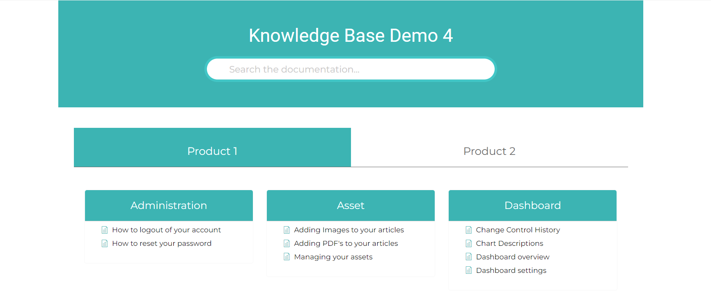
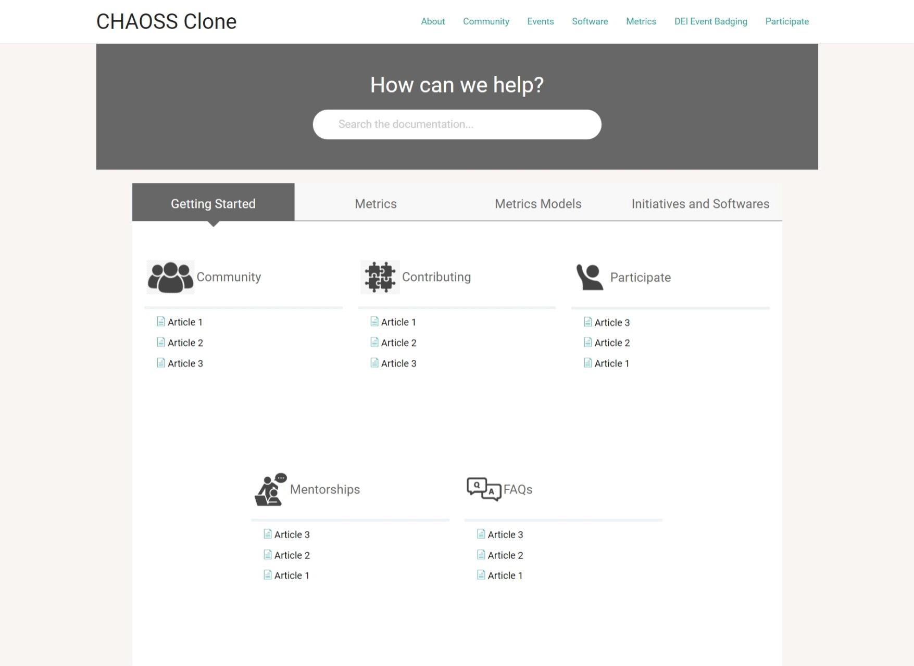

# Microtask - 4

> ## Create a report to present the results of your micro-tasks and your proposal for implementing a knowledgebase on the CHAOSS website. Document the plugins and describe your design choices. Include links to your example implementations on your WordPress site.

# Knowledge Base Plugins

## BetterDocs Plugin

### **Implementation - http://chaossclone.ga/docs/**

The first knowledge base implemented on the website is through the BetterDocs Plugin. BetterDocs is the most popular free plugin for creating knowledge bases over WordPress. One can find the details of the plugin through the research done in [microtask-1](./microtask-1.md#1-betterdocs)

BetterDocs offers a couple of free designs. I tried implementing and creating categories that would suit the knowledge base structure.

### UI Example - 1

### UI Example - 2

The above designs are free. BetterDocs offers three more layouts in its pro feature that can be tried depending on the mentors' opinions.

I personally found the second UI to have better UX, but at the same time, it has a little bug when it comes to subcategory organization. (Bug - Card size for a category doesn't change when a subcategory is opened, thereby hiding the content sometimes).

BetterDocs also has a feature to implement multiple knowledge bases. The multiple KBs feature could be helpful to prevent having deeply nested information. However, the feature is available only in the Pro pack.

Example:

For now, I have used the first example on the implemented website for simplicity purposes. 

## Echo Knowledge Base Plugin

### **Implementation - http://chaossclone.ga/echo-knowledge-base/**

The second plugin used on the website is the Echo Knowledge Base Plugin. The details of the plugin can be found through the research done in [microtask-1](./microtask-1.md#2-echo-knowledge-base)

The major advantage of the Echo Knowledge base over BetterDocs was that the plugin offered easy high-level categorization options. These can be used instead of creating multiple knowledge bases. These designs are ideal for product-based sites that showcase different products, but they suit the CHAOSS Project's requirements too.

Example:

I identified three categories in which the information could be classified given its vast amount.

- Getting Started
- Metrics
- DEI Badging
- Initiatives and Softwares

This kind of classification can be helpful to avoid putting the information too deep in the knowledgebase and thus reducing its accessibility to users.

<!-- --- -->

## Summary

There are a variety of knowledge base plugins available for free. The paid ones offer a few more features, one of them being the analytics that can help judge what the user is searching and how easily they are finding the required information that is being provided

Another way to go could be to use a free plugin and later upgrade it by paying the required amount. However, if one chooses to create a simple knowledge base without overloading it with extra features, then the free versions are more than enough.

Through the research that I did through these microtasks, I am in favour of creating a knowledge base similar to as implemented in the [second example](#echo-knowledge-base-plugin) or having multiple knowledge bases. 

This high-level categorization of topics can help users quickly locate the information they desire and reduces one level of nesting. This may not sound like much, but these things matter a lot in improving the user experience.

That being said, the above summarization is purely through my ideas and understanding of the requirements for a user that would come looking for information. I am open to any other ideas that the mentors may suggest and would be willing to try them as well.

